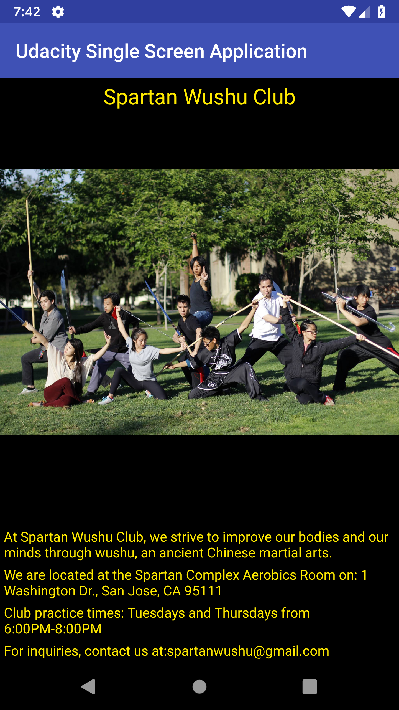

# Udacity Android Basics Nanodegree - UdacitySingleScreenApplication
This repository contains the UdacitySingleScreenApplication app from Udacity's User Interface course. This app is created using Android 
Studio. The layout was designed in an XML document using a RelativeLayout with an ImageView and TextViews.

## Overview
UdacitySingleScreenApplication displays information about the Spartan Wushu club at San Jose State University, including practice date, 
times, location, and an image of the team.

